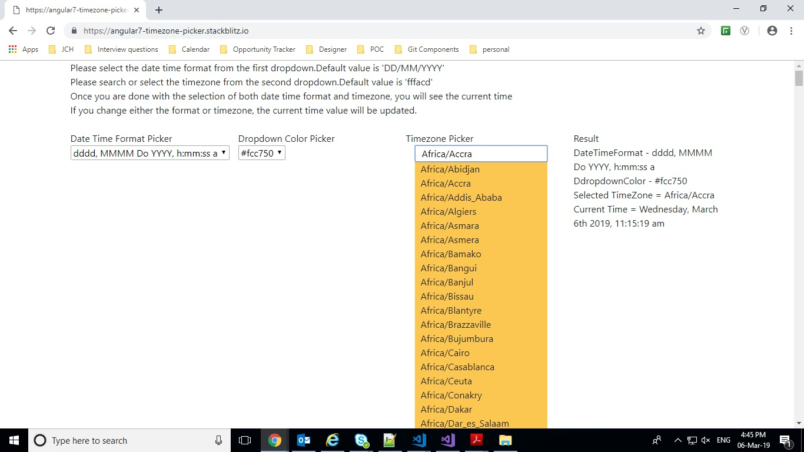
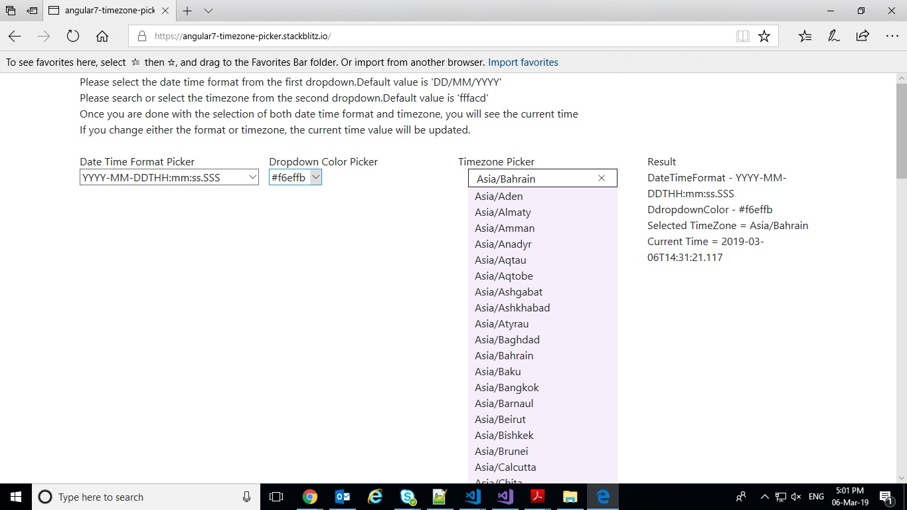
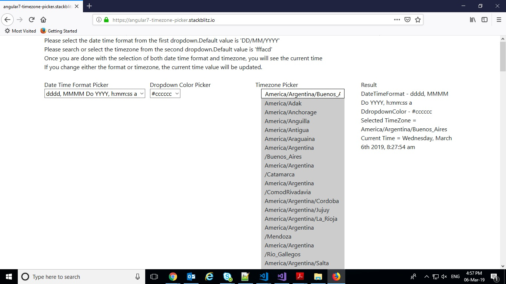
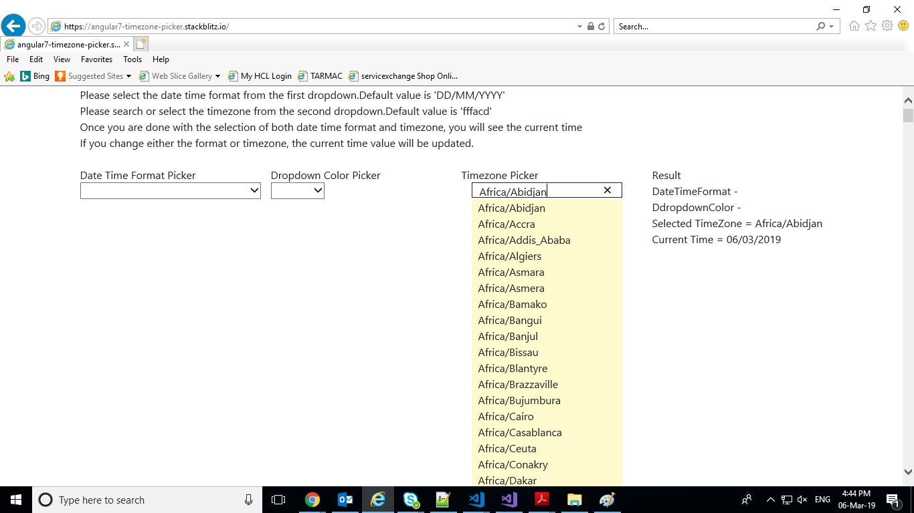
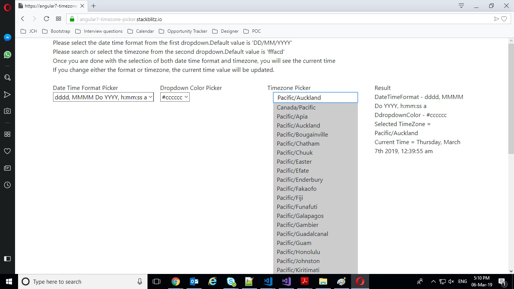

# Timezone Picker

Timezone Picker created using Angular 7,  MomentJSTimezone and Bootstrap displays the list of timezones provided by momentjs library and displays the current time in a dateformat provided by the user.
The complete list of timezones can be checked from this link - https://en.wikipedia.org/wiki/List_of_tz_database_time_zones 







## Demo

Checkout the demo on StackBlitz - https://angular7-timezone-picker.stackblitz.io/ 

## Adding the component in your project

### Add Component in module
Import
`
import { TimezonePickerComponent } from './components/timezone-picker/timezone-picker.component';
`

Declaration
`
declarations: [
     TimezonePickerComponent
  ]
`

### Add selector in HTML

```
<app-timezone-picker [dropdownColor]="selectedDropdownColor" [dateTimeFormat]="selectedDateFormat" (output)="retrieveCurrentTime($event)"></app-timezone-picker>

```
### Selector Properties

Property `dateTimeFormat` represents date-time format which user wants to display in the current time after selecting a timezone from the dropdown. Default Value is 'DD/MM/YYYY'.
<br/>
`dropdownColor` represents the background color of dropdown which user wants to display for the list of timezones. Default value is 'fffacd'.
<br/>
`retrieveCurrentTime` returns the selected timezone and current time for the same from the list.

### timezone-picker.component.ts
``` typescript
import { Component, OnInit, Input, Output, EventEmitter, OnChanges,  SimpleChanges,
 ChangeDetectionStrategy, HostListener, ViewChild, ElementRef, AfterViewInit } from '@angular/core';
import * as moment from 'moment-timezone';

@Component({
  selector: 'app-timezone-picker',
  templateUrl: './timezone-picker.component.html',
  styleUrls: ['./timezone-picker.component.scss'],
  changeDetection: ChangeDetectionStrategy.OnPush
})
export class TimezonePickerComponent implements OnInit, OnChanges, AfterViewInit {

  @Input() dateTimeFormat;
  @Input() dropdownColor;
  @Output() output: any = new EventEmitter();
  @ViewChild('timeZoneContainer', {read: ElementRef}) tref: ElementRef;

  public timezones: any;
  public filteredTimeZones = '';
  public search = '';
  public selectedTimeZone = '';
  public currentTime = '';
  public displayTZ = false;
  constructor() {
  }

  ngOnInit() {
    if (!this.dateTimeFormat) {
      this.dateTimeFormat = 'DD/MM/YYYY';
    }
  if (!this.dropdownColor) {
      this.dropdownColor = '#fffacd';
    }
  }

  ngAfterViewInit() {
    this.getDefaultValues();
  }
  ngOnChanges(changes: SimpleChanges) {
    if (typeof changes.dateTimeFormat !== 'undefined') {
        const dateTimeFormatChange = changes['dateTimeFormat'];
        if (!dateTimeFormatChange.isFirstChange()) {
          this.returnTime(this.selectedTimeZone, dateTimeFormatChange.currentValue);
        }
    }
  }

  getDefaultValues() {
    this.timezones = moment.tz.names();
    this.filteredTimeZones = this.timezones;
  }

  updateList(search) {
    if (search === '') {
        this.selectedTimeZone = '';
        this.currentTime = '';
        this.returnTime(this.selectedTimeZone, this.dateTimeFormat);
    }
    this.filteredTimeZones = this.timezones.filter((timezone) => {
      return (timezone.toLowerCase().indexOf(search.toLowerCase()) !== -1);
    });
  }

  timezoneByName(index, timezone) {
    return timezone;
  }

  displayTime(timezone) {
    this.selectedTimeZone = timezone;
    this.search = this.selectedTimeZone;
    this.displayTZ = false;
    this.returnTime(this.selectedTimeZone, this.dateTimeFormat);
  }

  displayTimeZones() {
    if (this.filteredTimeZones.length > 0 && (this.search.length >= 0 || this.search !== this.selectedTimeZone)) {
      this.displayTZ = true;
    } else {
      this.displayTZ = false;
    }
  }

  returnTime(selectedTimeZone, dateTimeFormat) {
    if (selectedTimeZone !== '') {
      this.currentTime = moment.tz(selectedTimeZone).format(dateTimeFormat);
    }
    this.output.emit({ selectedTimeZone: selectedTimeZone, currentTime: this.currentTime});
  }

  closeDropDown() {
    this.displayTZ = false;
  }

  @HostListener('document:click', ['$event', '$event.target'])
  public onClick(event: MouseEvent, targetElement: HTMLElement): void {
      if (!targetElement) {
          return;
      }
      const clickedInside = this.tref.nativeElement.contains(targetElement);
      if (!clickedInside) {
           this.closeDropDown();
      }
  }
}
```

### timezone-picker.component.html

``` html

<div class="container" #timeZoneContainer>
  <div class="row">
    <div class="col-md-12">
      <input type="text" class="validate filter-input" id="timeZoneSearch" (keyup)="updateList(search)" [(ngModel)]="search" (mousedown)="displayTimeZones()">
      <div id="myDropdown" class="dropdown-content" [ngStyle]="{'background-color':dropdownColor}">
        <div [ngClass]="{displayDropdown:displayTZ==true,hideDropdown:displayTZ==false}">
          <div *ngFor="let timezone of filteredTimeZones">
            <span (click)="displayTime(timezone)">{{ timezone }}</span>
          </div>
        </div>
        <div *ngIf="filteredTimeZones.length === 0 &&  search.length !== 0">
            <span>No Timezone found</span>
        </div>
      </div>
    </div>
  </div>
</div>

```

### timezone-picker.component.scss

``` scss

.filter-input{
    width:100%;
    padding:0 10px;
}
.dropdown-content{
    width:100%;
    padding:0 10px;
}
.visibleDropdown{
    display:block;
}
.hideDropdown{
    display:none;
}

```

### timezone-picker.component.spec.ts

``` typescript
import { async, ComponentFixture, TestBed } from '@angular/core/testing';
import { FormsModule } from '@angular/forms';
import { TimezonePickerComponent } from './timezone-picker.component';
import * as moment from 'moment-timezone';
import { By } from '@angular/platform-browser';

describe('TimezonePickerComponent', () => {
  let component: TimezonePickerComponent;
  let fixture: ComponentFixture<TimezonePickerComponent>;
  let timeZoneSearchTextboxEl;
  let dropdownContentEl;
  let output;

  beforeEach(async(() => {
    TestBed.configureTestingModule({
      declarations: [ TimezonePickerComponent ],
      imports: [FormsModule]
    })
    .compileComponents();
  }));

  beforeEach(() => {
    fixture = TestBed.createComponent(TimezonePickerComponent);
    component = fixture.componentInstance;
    fixture.detectChanges();
    timeZoneSearchTextboxEl =  fixture.debugElement.query(By.css('input'));
    dropdownContentEl = fixture.debugElement.query(By.css('#myDropdown'));
  });

  it('should create', () => {
    expect(component).toBeTruthy();
  });

  it('Intializing the datetimeformat to blank and chekcing the intial values of search and selected timezone', () => {
    component.dateTimeFormat = '';
    component.dropdownColor = '';
    fixture.detectChanges();
    expect(component.search).toBe('');
    expect(timeZoneSearchTextboxEl.nativeElement.value).toEqual('');
    expect(component.selectedTimeZone).toBe('');
  });

  it('changing the dateTimeFormat to "YYYY-MM-DDTHH:mm:ss.SSS" and timezone to "Africa/Cairo"', () => {
    component.dateTimeFormat = 'YYYY-MM-DDTHH:mm:ss.SSS';
    component.dropdownColor = '#cecece';
    timeZoneSearchTextboxEl.nativeElement.value = 'Africa/Cairo';
    timeZoneSearchTextboxEl.nativeElement.dispatchEvent(new Event('input'));
    component.output.subscribe((value) => {
      output = value;
      expect(output.selectedTimeZone).toBe('Africa/Cairo');
      expect(output.currentTime).toBe(moment.tz(output.selectedTimeZone).format(timeZoneSearchTextboxEl.nativeElement.value));
      expect(dropdownContentEl.nativeElement.backgroundColor).toBe('#cecece');
    });
    expect(component.search).toBe('Africa/Cairo');
  });
});

```
## Author

parasmani.jain2208@gmail.com

